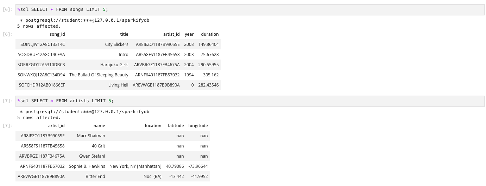

## Project 1: Data Modeling with Postgres

The main goal of this project is design a star schema for the database of Sparkify's streaming app.
This information could help help the company to understand the habits of its users, knowing which songs they listen and also which songs on the app are more listened.

### Database Schema Design

The star schema tables are described below:

- songplays

 This is the fact table of the schema. It contains information regarding the songs that were played on the app and also artist information and app user information 

- songs

 Dimension table which constains information about songs played on the app 

- users

 Dimension table which contains information about users of the streaming app 

- time

 Dimension table which contains information about user events of the streaming app 

- artists

 Dimension table which contains information about artists 

### ETL Pipeline

 The ETL pipeline was built step by step on a notebook and after that converted to a python script. The pipeline inserts on tables songplays, songs, users, time and artists.

The pipeline contains the files below:

- sql_queries.py: file which contains all sql commands for each table
- create_tables.py: script that create and delete tables
- etl.ypynb: python notebook that contains all steps of the ETL process
- et1.py: script python that contains all steps of the ETL process
- test.ipynb: python notebokk for tests

## DUPLICATED ROWS

 Tables user, artist, songs and time had duplicated rows. This problem was solved by the command "ON CONFLICT" in the insert query.

###  FINAL DATABASE

### COMMANDS

- command to create tables: python create_tables.py
- command to run the ETL Pipeline: python etl.py
